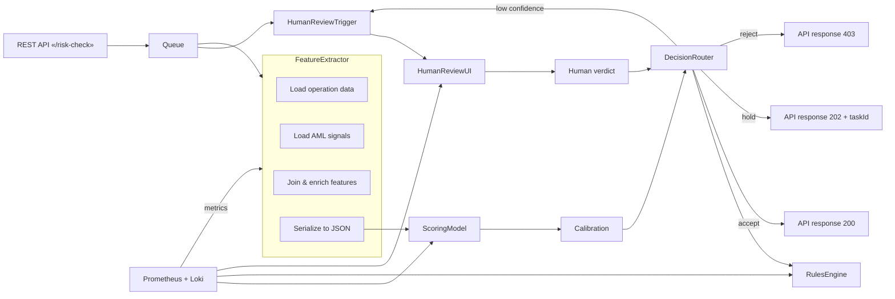

## Задание 3. Разработка архитектуры AI‑сервиса для RetailBank  

Ниже представлены все требуемые артефакты для **флагманской** инициативы (выявление подозрительных операций **F**) и двух сопутствующих инициатив ( **A** и ** B**):

| № | Инициатива | Тип решения | Краткое описание |
|---|------------|-------------|------------------|
| **F** | **Выявление подозрительных операций (транзит, обналичивание, дробление платежей)** | Табличный скоринг + детекция аномалий (ML) + правило‑based согласование | Конвейер «признаки → модель → калибровка/порог → бизнес‑правила → человек». |
| **A** | **Оцифровка сканов документов (PDF / фото) в кредитных заявках** | OCR + NLP‑extraction (ML) + валидация бизнес‑правил | Конвейер «загрузка → извлечение текста → выделение полей → проверка → человек». |
| **B** | **Маршрутизация входящих обращений (чат/звонок/заявка) в нужные отделы** | Классификатор текста (ML) + правила маршрутизации | Конвейер «текст → модель‑классификатор → правила → очередь/человек». |

---

### C4‑диаграммы  

#### Container‑diagram для флагмана (инициатива F)  

```mermaid
graph TB
    %% Блоки
    subgraph "RetailBank Core"
        direction TB
        DB[(Database<br/>Операционные<br/>источники, справочники)]
        AML[AML Platform<br/>KYC, внешние сигналы]
        FE[Frontend / API<br/>Внутренняя система мониторинга]
    end

    subgraph "AI Service"
        direction TB
        Queue[Message Queue<br/>Kafka / RabbitMQ]
        FeatureService[Feature Extraction Service<br/>deterministic (Scala/Java)]
        ScoringModel[ML Scoring Model<br/>XGBoost / LightGBM]
        Calibration[Calibration & Threshold Service]
        RulesEngine[Deterministic Rules Engine<br/>Drools / custom]
        HumanReview[Human Review UI<br/>Web‑app (25 analysts)]
    end

    %% Связи
    FE -->|Запрос на проверку операции| Queue
    Queue --> FeatureService
    FeatureService -->|features (JSON)| ScoringModel
    ScoringModel -->|rawScore| Calibration
    Calibration -->|decision (accept/hold/alert)| RulesEngine
    RulesEngine -->|finalDecision| FE
    RulesEngine -->|при отклонении| HumanReview
    HumanReview -->|подтверждённый verdict| FE

    %% Сторонние сервисы
    AML -->|RiskScore, watch‑lists| FeatureService
    DB -->|операционные данные| FeatureService
    DB -.->|история решений| RulesEngine
```  

#### omponent‑diagram для флагмана  



#### Container‑diagram для инициатив **A** (оцифровка документов) и **B** (маршрутизация обращений)  


```mermaid
graph TB
    subgraph "RetailBank Core"
        DB[(DB: Операции, заявки, справочники)]
        AML[AML/KYC Platform]
        Front[Frontend / API]
    end

    subgraph "AI Service – Docs (A)"
        DocQueue[Message Queue – Docs]
        OCRService[OCR (Tesseract / Azure OCR)]
        NLPExtractor[NLP Extraction (BERT)]
        DocValidator[Deterministic Validation Rules]
        DocHuman[Human Review UI – Docs]
    end

    subgraph "AI Service – Routing (B)"
        MsgQueue[Message Queue – Requests]
        TextPreproc[Text Pre‑processing]
        Classifier[ML Classifier (FastText / RoBERTa)]
        RoutingRules[Deterministic Routing Rules]
        RoutingHuman[Human Review UI – Routing]
    end

    %% Flows Docs
    Front -->|upload doc| DocQueue
    DocQueue --> OCRService --> NLPExtractor --> DocValidator
    DocValidator -->|high confidence| Front
    DocValidator -->|low confidence| DocHuman -->|approval| Front

    %% Flows Routing
    Front -->|incoming request| MsgQueue
    MsgQueue --> TextPreproc --> Classifier --> RoutingRules
    RoutingRules -->|auto route| Front
    RoutingRules -->|needs review| RoutingHuman -->|decision| Front

    %% Shared services
    DB --> OCRService
    DB --> TextPreproc
    AML --> NLPExtractor
    AML --> Classifier
```  

---

## Таблица ответственности компонентов (RACI)

| Компонент | Ответственный (R) | Консультируемый (C) | Информируемый (I) | Выполняемый (A) |
|-----------|-------------------|---------------------|-------------------|-----------------|
| **Frontend / API** | Team API (Backend) | Product Owner, AML Team | Аналитики, Служба мониторинга | Team API |
| **Message Queue** | Platform Ops | Team API, Data Engineers | Все команды | Platform Ops |
| **Feature Extraction Service** | Data Engineering | AML Team, Compliance | Product Owner | Data Engineering |
| **ML Scoring Model** | Data Science | Feature Service, Compliance | Product Owner | Data Science |
| **Calibration & Threshold Service** | Data Science | Business Analyst | Product Owner | Data Science |
| **Deterministic Rules Engine** | Business Rules Team | Compliance, Risk | Product Owner | Business Rules Team |
| **Human Review UI** | UX/Frontend Team | Business Analyst, Compliance | Product Owner | UX/Frontend Team |
| **OCR Service** | Document Engineering | Compliance, Legal | Product Owner | Document Engineering |
| **NLP Extraction** | Data Science / NLP Team | Document Engineering | Product Owner | NLP Team |
| **Doc Validation Rules** | Business Rules Team | Compliance | Product Owner | Business Rules Team |
| **Routing Classifier** | Data Science (NLP) | Customer Service Ops | Product Owner | Data Science |
| **Routing Rules Engine** | Business Rules Team | Customer Service | Product Owner | Business Rules Team |
| **Monitoring (Prometheus + Loki)** | SRE / Platform Ops | All команды | Руководство | SRE |

---

## Выходной контракт (Response Schema)

### Выявление подозрительных операций (флагман)

```json
{
  "requestId": "string (uuid)",
  "operationId": "string",
  "decision": "enum[accept, hold, reject]",
  "score": "number (0‑1)",
  "modelVersion": "string",
  "featuresUsed": ["list of feature names"],
  "ruleTriggers": ["list of rule identifiers (if any)"],
  "humanReviewRequired": "boolean",
  "humanVerdict": "enum[accept, reject, pending] | null",
  "timestamp": "ISO‑8601",
  "source": {
    "operationRecordId": "string",
    "amlsignalIds": ["array of ids"]
  },
  "validation": {
    "schemaValid": "boolean",
    "missingFields": ["array"]
  },
  "audit": {
    "processingTimeMs": "integer",
    "queueDelayMs": "integer"
  }
}
```
* **Обязательные поля** – `requestId`, `operationId`, `decision`, `score`, `modelVersion`, `timestamp`, `source`.
* **Поведение при отсутствии данных** – если требуемые признаки недоступны → `decision: hold`, `humanReviewRequired: true`.
* **Валидация до бизнес‑действия** – `schemaValid` must be `true`; иначе отклонить запрос с кодом 400.

### Оцифровка документов (инициатива A)

```json
{
  "requestId": "string (uuid)",
  "documentId": "string",
  "extractedFields": {
    "fieldName": "value",
    "...": "..."
  },
  "confidence": "number (0‑1)",
  "modelVersion": "string",
  "validation": {
    "schemaValid": "boolean",
    "missingFields": ["array"]
  },
  "humanReviewRequired": "boolean",
  "humanVerdict": "enum[accept, reject, needsCorrection] | null",
  "timestamp": "ISO‑8601"
}
```

### Маршрутизация обращений (инициатива B)

```json
{
  "requestId": "string (uuid)",
  "channel": "enum[chat, phone, email, form]",
  "text": "string",
  "predictedQueue": "string",
  "confidence": "number (0‑1)",
  "modelVersion": "string",
  "ruleApplied": "boolean",
  "humanReviewRequired": "boolean",
  "humanDecision": "string | null",
  "timestamp": "ISO‑8601"
}
```

---

## Уровень автоматизации  

| Сценарий | Что делает модель | Что делает детерминированный код | Где обязательен человек |
|----------|------------------|-----------------------------------|------------------------|
| **F – обычный поток** | Выдаёт протокол `score` (0‑1) | Применяет калибровочный порог + правила AML | Если `confidence < 0.7` **или** `score` в зоне “зазор” (0.45‑0.55) → Human Review |
| **F – экстренный‑порог** | При превышении `score > 0.9` → автоматический `reject` | Записывает событие в журнал | Нет (аварийный сценарий) |
| **A – OCR/NLP** | Распознаёт текст, выделяет поля | Проверка формата, наличие обязательных полей | Если `confidence < 0.8` **или** конфликт данных → Human Review |
| **B – маршрутизация** | Классифицирует запрос в один из 8‑ти потоков | Если классификатор не уверен (`confidence < 0.6`) → правило‑fallback → «Общий центр» | При конфликте с бизнес‑правилами (например, запрос от VIP‑клиента) → Human Review |

---

## Fallback‑стратегии  

| Признак отклонения | Действие | Куда направляется |
|--------------------|----------|-------------------|
| **Отсутствие/устаревание признаков** (F) | Переключить в режим *hold*, добавить в очередь Human Review | Human Review UI |
| **Значение за пределами обучающей выборки** (score > 0.95 и < 0.05) | Автоматический *reject*/*accept* + лог‑аудит | Финальная система |
| **Клиент без истории** (новый юр/ип) | Увеличить порог, включить Human Review | Human Review UI |
| **Score в зоне “зазор”** (0.45‑0.55) | Требовать подтверждение человека | Human Review UI |
| **Расхождение модели vs. правило** | Приоритет правила → автоматический отказ + лог | Финальная система |
| **Недоступность модели/сервиса** | Переключить на детерминированный набор правил (rule‑only) | Rules Engine → автоматический *reject*/*hold* |
| **Неправильный формат ответа модели** (невалидный JSON) | Сгенерировать `400 Bad Request`, логировать | API клиент |
| **Не прошёл схему ответа в извлечении документов** | Human Review (показываем оригинал + извлечённые поля) | Doc Human Review UI |
| **Противоречивые документы** | Human Review с рекомендацией «документы противоречат» | Doc Human Review UI |
| **Запрос вне области применимости** (например, запрос про инвестиции) | Отказать, вернуть `403` + ссылка на справку | API клиент |
| **Отказ внешнего сервиса (KYC API, OCR SaaS)** | Перейти в «offline‑mode» → использовать только локальные правила | Rules Engine |
| **Превышение лимитов очереди** | Дрейн‑режим: новые запросы → Human Review сразу | Human Review UI |

---

## План мониторинга  

| Уровень | Метрика | Порог тревоги | Действие |
|----------|---------|---------------|----------|
| **Вход (API)** | `request_rate`, `error_rate (4xx/5xx)` | > 200 req/s, > 2 % 5xx | Авто‑скейлинг, алерт SRE |
| **Очереди** | `queue_length`, `lag_ms` | > 10 000 сообщений, `lag_ms > 5 000` | Увеличить consumer‑поток, алерт |
| **Feature Service** | `feature_extraction_time_ms`, `missing_features_rate` | > 200 ms, > 5 % missing | Перезапуск, проверка источников |
| **ML Model** | `model_latency_ms`, `prediction_confidence_distribution`, `drift_score` (PSI) | > 150 ms, confidence‑skew > 0.2, PSI > 0.1 | Перезапуск модели, переобучение |
| **Calibration & Rules** | `rule_trigger_rate`, `threshold_violations` | > 30 % hold‑rate | Пересмотр порогов |
| **Human Review** | `average_review_time`, `queue_backlog_human`, `escalation_rate` | > 15 min, backlog > 500, escalations > 10 % | Добавить аналитика, увеличить staffing |
| **Бизнес‑метрика** | `false_positive_rate`, `false_negative_rate`, `blocked_transactions_per_month` | FP > 3 %, FN > 1 % | Пересчитать стоимость ошибки, откат модели |
| **Безопасность** | `sensitive_data_leak_events`, `unauthorized_access_attempts` | > 0 | Немедленный инцидент‑процесс |

*Автоматический запуск повторной проверки* – если `drift_score` превышает порог, система автоматически помещает текущую модель в режим «read‑only» и генерирует задачу переобучения.

---

## Границы доверия и таблица угроз  

На всех диаграммах пунктирными линиями отмечены границы, где переходит **недоверенный** контент (внешние сигналы, клиентские документы, запросы API). Ниже – подробный список.

| № | Граница (на схеме) | Тип данных | Угроза | Мероприятие (митация) |
|---|----------------------|------------|--------|------------------------|
| **1** | Frontend → Message Queue (внешний запрос) | Неаутентифицированный клиентский запрос | Инъекция/DoS, подделка данных | Валидация JSON‑схемы, rate‑limiting, OAuth 2.0 + подпись JWT |
| **2** | Feature Extraction Service ← DB/AML | Доступ к историческим операциям, KYC‑сигналы | Утечка ПДн, несанкционированный доступ | RBAC, шифрование в‑транзите TLS 1.3, аудит запросов |
| **3** | Scoring Model ← Feature Service | Признаки, сформированные автоматически | Подмена признаков (adversarial), модельный ворнинг | Подпись данных HMAC, контроль целостности, модель‑signature |
| **4** | Calibration ← Scoring Model | Выход модели (score) | Пере‑/недо‑оценка, «model drift» | Мониторинг drift, автотесты, откат версии |
| **5** | Rules Engine ← Model/Calibration | Принятые решения | Конфликт бизнес‑правил, «rule poisoning» | Тест‑suite правил, ограничение прав на правку |
| **6** | Human Review UI ← Rules Engine | Запрос на проверку (hold) | Социальный инженеринг, утечка конфиденциальных данных | MFA для аналитиков, аудио‑логирование, DLP‑политика |
| **7** | OCR/NLP Service ← Frontend (документы) | Скан PDF/изображения (неструктурированный) | Вредоносный файл, steganography, XSS | Проверка MIME‑type, сканирование на вирусы, ограничение размеров |
| **8** | Routing Classifier ← Text Pre‑proc | Текст обращения | Текстовая атака (prompt‑injection) | Очистка/экранирование, whitelist‑словарей |
| **9** | External AML/KYC API → Feature Service | Внешний риск‑сигнал | Перехват/модификация ответа | TLS, подпись API‑ключей, проверка контрольных сумм |

