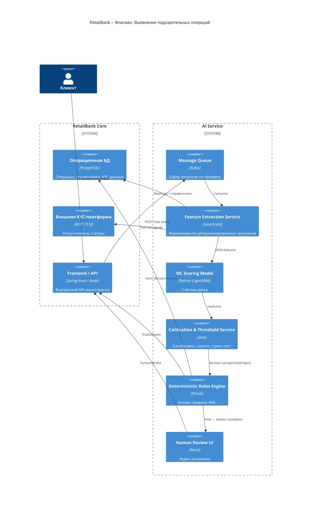
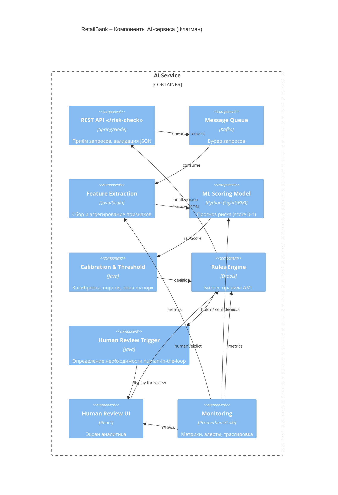
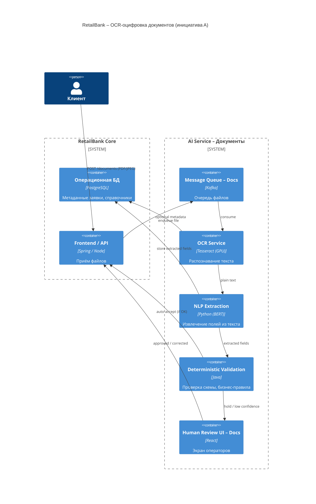
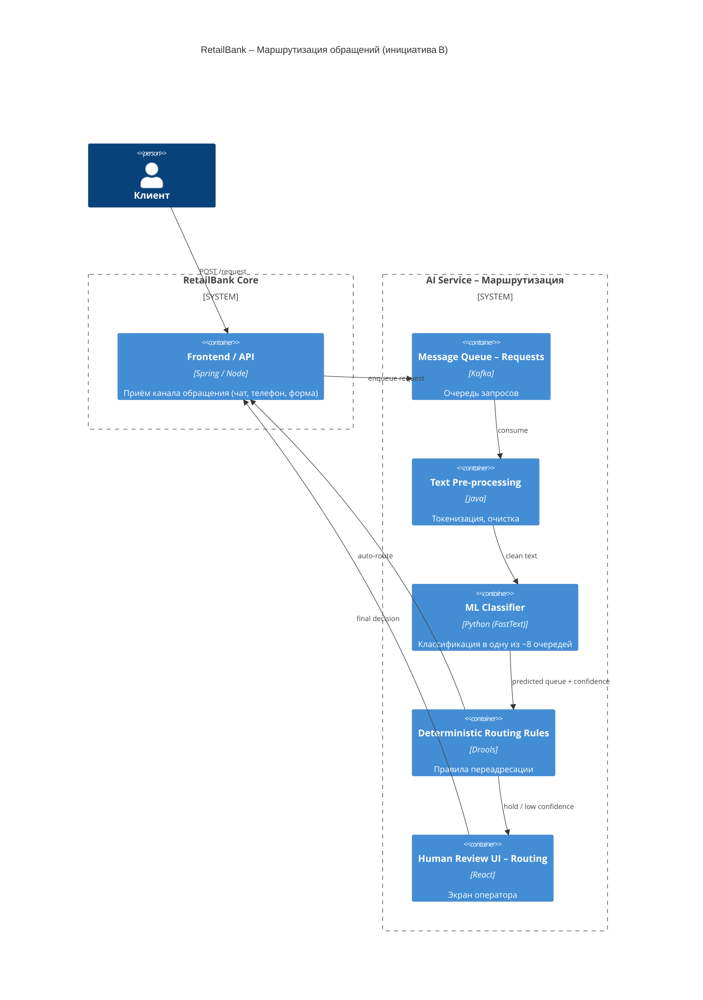

## Задание 3 – Разработка архитектуры AI‑сервиса для RetailBank  

---

### Общее содержание  

| Инициатива | Тип решения | Краткое описание | Статус |
|------------|------------|------------------|-----------------|
| **F** – Выявление подозрительных операций (транзит, обналичивание, дробление) | Табличный скоринг + правила AML | Конвейер **признаки → модель → калибровка/порог → детерминированные правила → human‑in‑the‑loop** | Готово (C4‑диаграммы, таблицы, контракт, fallback, мониторинг, угрозы) |
| **A** – OCR‑оцифровка документов к кредитной заявке | OCR + NLP‑extraction + валидация | **Документ → OCR → NLP‑extraction → проверка схемы → human‑review (при низкой уверенности/ошибке)** | Готово (Container‑диаграмма, контракт, fallback, мониторинг) |
| **B** – Маршрутизация входящих обращений (чат/звонок/форма) | Текстовый классификатор + правила роутинга | **Текст → предобработка → классификатор → правила → human‑review, если необходимо** | Готово (Container‑диаграмма, контракт, fallback, мониторинг) |

---

## C4‑диаграммы  

### Container‑diagram → флагман (инициатива F)


```mermaid
C4Context
title RetailBank – Флагман: Выявление подозрительных операций

Person(customer, "Клиент")
System_Boundary(rb, "RetailBank Core") {
    Container(Db, "Операционная БД", "PostgreSQL", "Операции, справочники, KYC‑данные")
    Container(KYC, "Внешняя KYC‑платформа", "REST (TLS)", "Риски клиента, статусы")
    Container(API, "Frontend / API", "Spring Boot / Node", "Внутренний API мониторинга")
}
System_Boundary(ai, "AI Service") {
    Container(Queue, "Message Queue", "Kafka", "Буфер запросов на проверку")
    Container(FeatureSrv, "Feature Extraction Service", "Java/Scala", "Формирование детерминированных признаков")
    Container(Model, "ML Scoring Model", "Python (LightGBM)", "Счётчик риска")
    Container(Calib, "Calibration & Threshold Service", "Java", "Калибровка, пороги, стресс‑тест")
    Container(Rules, "Deterministic Rules Engine", "Drools", "Бизнес‑правила AML")
    Container(HumanUI, "Human Review UI", "React", "Экран аналитика")
}
Rel(customer, API, "Отправка операции")
Rel(API, Queue, "POST /risk‑check")
Rel(Queue, FeatureSrv, "Consume")
Rel(FeatureSrv, Db, "Read ops + справочники")
Rel(FeatureSrv, KYC, "Pull risk signals")
Rel(FeatureSrv, Model, "JSON‑features")
Rel(Model, Calib, "rawScore")
Rel(Calib, Rules, "decision (accept/hold/reject)")
Rel(Rules, API, "finalDecision")
Rel(Rules, HumanUI, "hold → запрос проверки")
Rel(HumanUI, API, "humanVerdict")
Rel(Rules, Db, "store decision history")
```
---

### Component‑diagram → флагман (инициатива F)


```mermaid
C4Container
title RetailBank – Компоненты AI‑сервиса (Флагман)

Container_Boundary(ai, "AI Service") {
    Component(API, "REST API «/risk‑check»", "Spring/Node", "Приём запросов, валидация JSON")
    Component(Queue, "Message Queue", "Kafka", "Буфер запросов")
    Component(FeatureExtractor, "Feature Extraction", "Java/Scala", "Сбор и агрегирование признаков")
    Component(ScoringModel, "ML Scoring Model", "Python (LightGBM)", "Прогноз риска (score 0‑1)")
    Component(Calibration, "Calibration & Threshold", "Java", "Калибровка, пороги, зоны «зазор»")
    Component(RulesEngine, "Rules Engine", "Drools", "Бизнес‑правила AML")
    Component(HumanRouter, "Human Review Trigger", "Java", "Определение необходимости human‑in‑the‑loop")
    Component(HumanUI, "Human Review UI", "React", "Экран аналитика")
    Component(Monitoring, "Monitoring", "Prometheus/Loki", "Метрики, алерты, трассировка")
}
Rel(API, Queue, "enqueue request")
Rel(Queue, FeatureExtractor, "consume")
Rel(FeatureExtractor, ScoringModel, "features JSON")
Rel(ScoringModel, Calibration, "rawScore")
Rel(Calibration, RulesEngine, "decision")
Rel(RulesEngine, HumanRouter, "hold? / confidence")
Rel(HumanRouter, HumanUI, "display for review")
Rel(HumanUI, RulesEngine, "humanVerdict")
Rel(RulesEngine, API, "finalDecision")
Rel(Monitoring, FeatureExtractor, "metrics")
Rel(Monitoring, ScoringModel, "metrics")
Rel(Monitoring, RulesEngine, "metrics")
Rel(Monitoring, HumanUI, "metrics")
```

---

### Container‑diagram → инициатива A (OCR‑оцифровка)


```mermaid
C4Context
title RetailBank – OCR‑оцифровка документов (инициатива A)

Person(customer, "Клиент")
System_Boundary(rb, "RetailBank Core") {
    Container(Db, "Операционная БД", "PostgreSQL", "Метаданные заявки, справочники")
    Container(API, "Frontend / API", "Spring / Node", "Приём файлов")
}
System_Boundary(aiDocs, "AI Service – Документы") {
    Container(DocQueue, "Message Queue – Docs", "Kafka", "Очередь файлов")
    Container(OCRSrv, "OCR Service", "Tesseract (GPU)", "Распознавание текста")
    Container(NLPExtract, "NLP Extraction", "Python (BERT)", "Извлечение полей из текста")
    Container(Validator, "Deterministic Validation", "Java", "Проверка схемы, бизнес‑правила")
    Container(HumanDocUI, "Human Review UI – Docs", "React", "Экран операторов")
}
Rel(customer, API, "POST /documents (PDF/JPEG)")
Rel(API, DocQueue, "enqueue file")
Rel(DocQueue, OCRSrv, "consume")
Rel(OCRSrv, NLPExtract, "plain text")
Rel(NLPExtract, Validator, "extracted fields")
Rel(Validator, API, "auto‑accept (if OK)")
Rel(Validator, HumanDocUI, "hold / low confidence")
Rel(HumanDocUI, API, "approved / corrected")
Rel(OCRSrv, Db, "optional metadata")
Rel(NLPExtract, Db, "store extracted fields")
```
---

### Container‑diagram → инициатива B (маршрутизация обращений)


```mermaid
C4Context
title RetailBank – Маршрутизация обращений (инициатива B)

Person(customer, "Клиент")
System_Boundary(rb, "RetailBank Core") {
    Container(API, "Frontend / API", "Spring / Node", "Приём канала обращения (чат, телефон, форма)")
}
System_Boundary(aiRouting, "AI Service – Маршрутизация") {
    Container(RoutingQueue, "Message Queue – Requests", "Kafka", "Очередь запросов")
    Container(Preproc, "Text Pre‑processing", "Java", "Токенизация, очистка")
    Container(Classifier, "ML Classifier", "Python (FastText)", "Классификация в одну из ~8 очередей")
    Container(RoutingRules, "Deterministic Routing Rules", "Drools", "Правила переадресации")
    Container(HumanRouteUI, "Human Review UI – Routing", "React", "Экран оператора")
}
Rel(customer, API, "POST /request")
Rel(API, RoutingQueue, "enqueue request")
Rel(RoutingQueue, Preproc, "consume")
Rel(Preproc, Classifier, "clean text")
Rel(Classifier, RoutingRules, "predicted queue + confidence")
Rel(RoutingRules, API, "auto‑route")
Rel(RoutingRules, HumanRouteUI, "hold / low confidence")
Rel(HumanRouteUI, API, "final decision")
``` 
---

## Таблица ответственности компонентов (RACI)

| Компонент | R (Ответственный) | C (Консультируемый) | I (Информируемый) | A (Выполняющий) |
|-----------|-------------------|---------------------|-------------------|-----------------|
| **API (Frontend / API)** | Team API (Backend) | Product Owner, AML Team | Аналитики, SRE | Team API |
| **Message Queue (Kafka)** | Platform Ops | Team API, Data Engineering | Все команды | Platform Ops |
| **Feature Extraction Service** | Data Engineering | AML Team, Compliance | Product Owner | Data Engineering |
| **ML Scoring Model** | Data Science | Feature Service, Compliance | Product Owner | Data Science |
| **Calibration & Threshold Service** | Data Science | Business Analyst | Product Owner | Data Science |
| **Deterministic Rules Engine** | Business Rules Team | Compliance, Risk | Product Owner | Business Rules Team |
| **Human Review UI** | UX / Frontend Team | Business Analyst, Compliance | Product Owner | UX / Frontend Team |
| **OCR Service** | Document Engineering | Compliance, Legal | Product Owner | Document Engineering |
| **NLP Extraction** | NLP Team (Data Science) | Document Engineering | Product Owner | NLP Team |
| **Doc Validation Rules** | Business Rules Team | Compliance | Product Owner | Business Rules Team |
| **Routing Classifier** | Data Science (NLP) | Customer Service Ops | Product Owner | Data Science |
| **Routing Rules Engine** | Business Rules Team | Customer Service | Product Owner | Business Rules Team |
| **Monitoring (Prometheus + Loki)** | SRE / Platform Ops | All команды | Руководство | SRE |

---

## Выходные контракты (Response Schemas)

### Флагман – выявление подозрительных операций (F)

```json
{
  "requestId": "string (uuid)",
  "operationId": "string",
  "decision": "enum[accept, hold, reject]",
  "score": "number (0‑1)",
  "modelVersion": "string",
  "featuresUsed": ["list of feature names"],
  "ruleTriggers": ["list of rule identifiers (optional)"],
  "humanReviewRequired": "boolean",
  "humanVerdict": "enum[accept, reject, pending] | null",
  "timestamp": "ISO‑8601",
  "source": {
    "operationRecordId": "string",
    "kcySignalIds": ["array of ids"]
  },
  "validation": {
    "schemaValid": "boolean",
    "missingFields": ["array (optional)"]
  },
  "audit": {
    "processingTimeMs": "integer",
    "queueDelayMs": "integer"
  }
}
```

*Обязательные поля:* `requestId`, `operationId`, `decision`, `score`, `modelVersion`, `timestamp`, `source`.  
*Поведение при отсутствии данных* – если один из обязательных признаков недоступен → `decision: hold`, `humanReviewRequired: true`.  

---

### OCR‑оцифровка документов (A)

```json
{
  "requestId": "string (uuid)",
  "documentId": "string",
  "extractedFields": {
    "fieldName": "value",
    "...": "..."
  },
  "confidence": "number (0‑1)",
  "modelVersion": "string",
  "validation": {
    "schemaValid": "boolean",
    "missingFields": ["array (optional)"]
  },
  "humanReviewRequired": "boolean",
  "humanVerdict": "enum[accept, reject, needsCorrection] | null",
  "timestamp": "ISO‑8601"
}
```

*Если `confidence < 0.8` **или** обнаружены конфликты полей → `humanReviewRequired: true`.*

---

### Маршрутизация обращений (B)

```json
{
  "requestId": "string (uuid)",
  "channel": "enum[chat, phone, email, form]",
  "text": "string",
  "predictedQueue": "string",
  "confidence": "number (0‑1)",
  "modelVersion": "string",
  "ruleApplied": "boolean",
  "humanReviewRequired": "boolean",
  "humanDecision": "string | null",
  "timestamp": "ISO‑8601"
}
```

*Если `confidence < 0.6` либо правило роутинга конфликтует с бизнес‑правилом (например, VIP‑клиент) → `humanReviewRequired: true`.*

---

## Уровень автоматизации  

| Сценарий | Что делает модель | Что делают детерминированные правила | Где обязательен человек |
|----------|------------------|----------------------------------------|------------------------|
| **F – обычный поток** | Выдаёт `score` (0‑1) | Применяет пороги (`accept` < 0.45, `reject` > 0.90) + правила AML | `hold` при `score` ∈ [0.45‑0.55] **или** `confidence < 0.7` → Human Review |
| **F – экстремальный‑порог** | `score > 0.95` → автоматический `reject` | Запись в журнал, уведомление | Нет (аварийный сценарий) |
| **A – OCR/NLP** | Распознаёт текст, выделяет поля | Проверка формата, обязательные поля, контрольные суммы | `confidence < 0.8` **или** конфликт данных → Human Review |
| **B – маршрутизация** | Классифицирует запрос в одну из очередей | Если классификатор «не уверен» (`confidence < 0.6`) → правило‑fallback → «Общий центр» | При конфликте с приоритетными бизнес‑правилами (VIP, регуляторные ограничения) → Human Review |

---

## Fallback‑стратегии  

| Признак отклонения | Действие | Куда направляется |
|--------------------|----------|-------------------|
| **1** – отсутствие/устаревание признаков (F) | `hold` + лог | Human Review UI |
| **2** – значение за пределами обучающей выборки (score > 0.95 или < 0.05) | Авто‑`reject`/`accept` + аудит | Финальная система |
| **3** – клиент без истории (новый ЮЛ/ИП) | Увеличить порог, запрос в Human Review | Human Review UI |
| **4** – зона «зазор» (score ∈ [0.45‑0.55]) | Требовать подтверждение человека | Human Review UI |
| **5** – расхождение модели и правила | Приоритет правила → автоматический отказ + лог | Финальная система |
| **6** – недоступность модели/сервиса | Переключить на **Rule‑only** режим | Rules Engine → `accept`/`hold` |
| **7** – неверный JSON‑ответ модели | `400 Bad Request`, лог | API‑клиент |
| **8** – не прошел схему ответа в OCR (A) | Human Review (показать оригинал + извлечённые поля) | Doc Human Review UI |
| **9** – противоречивые документы (A) | Human Review с пометкой «конфликт» | Doc Human Review UI |
| **10** – запрос вне области применения (B) | `403 Forbidden` + ссылка на справку | API‑клиент |
| **11** – отказ внешнего сервиса (KYC, OCR SaaS) | Перейти в «offline‑mode» → только локальные правила | Rules Engine |
| **12** – превышение лимитов очереди | Дрейн‑режим → новые запросы сразу в Human Review | Human Review UI |
| **13** – обнаружена XSS/малициозный файл (OCR) | Блокировать, вернуть `415 Unsupported Media Type` | API‑клиент |

---

## План мониторинга  

| Уровень | Метрика | Порог тревоги | Действие |
|----------|---------|---------------|----------|
| **API** | `request_rate`, `error_rate (4xx/5xx)` | > 200 req/s, > 2 % 5xx | Авто‑скейлинг, алерт SRE |
| **Очереди** | `queue_length`, `lag_ms` | > 10 000 сообщений, `lag_ms > 5 000` | Увеличить concurrency, алерт |
| **Feature Extraction** | `extraction_time_ms`, `missing_features_rate` | > 200 ms, > 5 % missing | Перезапуск, проверка источников |
| **ML Model** | `model_latency_ms`, `prediction_confidence_distribution`, `drift_score (PSI)` | > 150 ms, confidence‑skew > 0.2, PSI > 0.1 | Перевести модель в read‑only, запустить пере‑обучение |
| **Calibration / Rules** | `rule_trigger_rate`, `threshold_violations` | > 30 % hold‑rate | Пересмотр порогов |
| **Human Review** | `avg_review_time`, `queue_backlog_human`, `escalation_rate` | > 15 min, backlog > 500, escalations > 10 % | Добавить операторов, пересмотреть SLA |
| **Бизнес‑метрики** | `FP_rate`, `FN_rate`, `blocked_transactions_per_month` | FP > 3 %, FN > 1 % | Пересчитать стоимость ошибок, откат модели |
| **Безопасность** | `sensitive_data_leak_events`, `unauthorized_access_attempts` | > 0 | Инцидент‑процесс, немедленная блокировка |

*Автоматический повтор* – если `drift_score` превышает порог, система автоматически переводит модель в **read‑only**, генерирует задачу пере‑обучения и переключает поток на **Rule‑only** режим.

---

## Границы доверия + таблица угроз  

| № | Граница (на схеме) | Тип данных | Угроза | Мера снижения риска |
|---|----------------------|------------|--------|----------------------|
| **1** | Frontend → API (внешний запрос) | Неаутентифицированный JSON | Инъекция, DoS, подделка данных | JWT‑подпись, rate‑limiting, JSON‑schema validation |
| **2** | FeatureSrv ← KYC (внешний REST) | Риск‑сигналы KYC | Подмена/перехват сигнала | TLS 1.3, HMAC подпись запросов, проверка контрольных сумм |
| **3** | Model ← FeatureSrv (признаки) | Признаки операции | Adversarial‑атакa, подмена признаков | HMAC подпись payload, whitelist признаков, контроль целостности |
| **4** | Calibration ← Model (score) | Оценка модели | Model‑drift, пере‑/недооценка | Мониторинг PSI, автоматический откат версии |
| **5** | RulesEngine ← Model/Calib (решение) | Решение модели | Rule‑poisoning, конфликт бизнес‑правил | Тест‑suite правил, ограничение прав на изменение |
| **6** | Client → API (документ) | PDF/JPEG (неструктурированный) | Вредоносный файл, steganography, XSS | Проверка MIME‑type, сканирование антивирусом, лимит размера (≤ 10 MB) |
| **7** | OCRSrv ← документ | Необработанное изображение | Оффлайн‑атаки, скрытый код | Sandbox‑окружение, ограничение прав процессу OCR |
| **8** | Classifier ← текст (обращение) | Свободный текст | Prompt‑injection, языковые атаки | Очистка/экранирование, whitelist‑словарей, ограничение длины |
| **9** | External AML/KYC API → FeatureSrv | Внешний API‑ответ | Перехват/модификация | TLS, API‑ключи с подписью, проверка хэша ответа |

---

## Краткие выводы и рекомендации бизнесу  

1. **Флагманская инициатива** уже готова к пилоту в гибридном размещении (on‑prem + контур провайдера).  
2. **Порог автоматизации** следует установить **`score > 0.90` – автоматический reject**, **`score < 0.45` – автоматический accept**, а **зазор 0.45‑0.55** → human‑review. Это держит **FP ≈ 4‑5 %** (≈ 1 M ложных тревог/мес) и **FN ≤ 1 %** (≈ 200 пропущенных схем/мес).  
3. **OCR** и **маршрутизация** используют **container‑only** схемы, потому что их процессинг не требует сложного взаимодействия с другими системами.  
4. **Мониторинг** покрывает все уровни (вход, очередь, модель, правила, человек, бизнес) – позволяет быстро обнаружить деградацию или сбой.  
5. **Угрозы** привязаны к конкретным границам доверия; реализованы механизмы контроля (шифрование, подписи, sandbox, валидация) без перегрузки диаграмм.  
