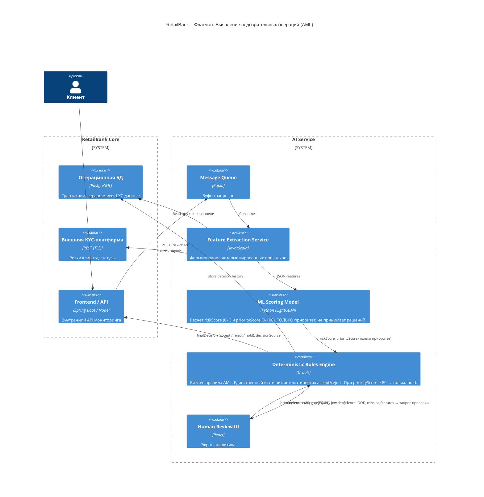
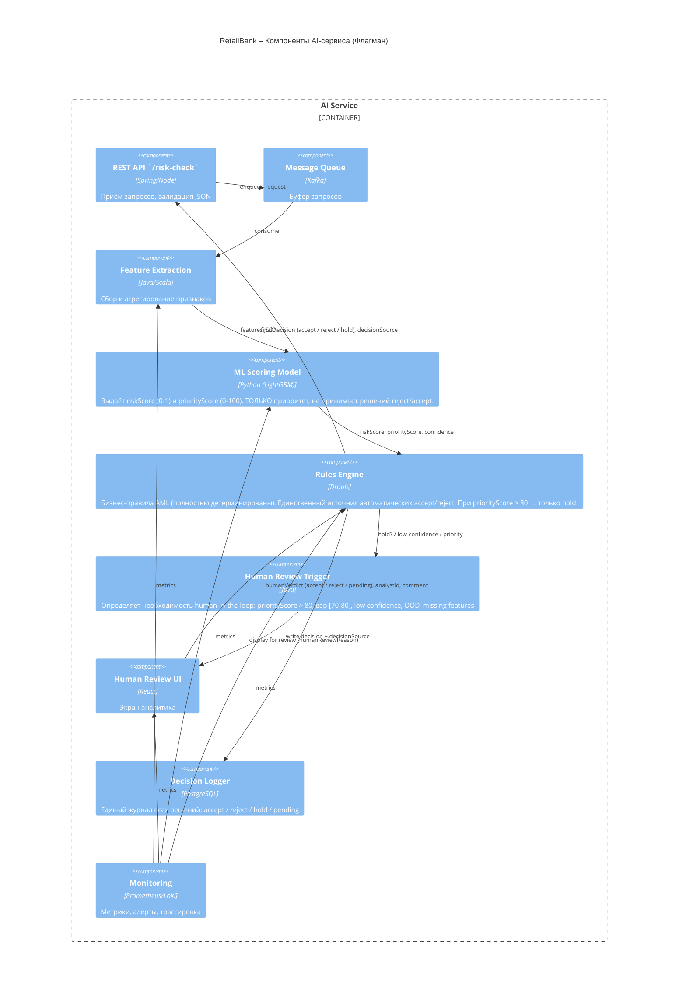
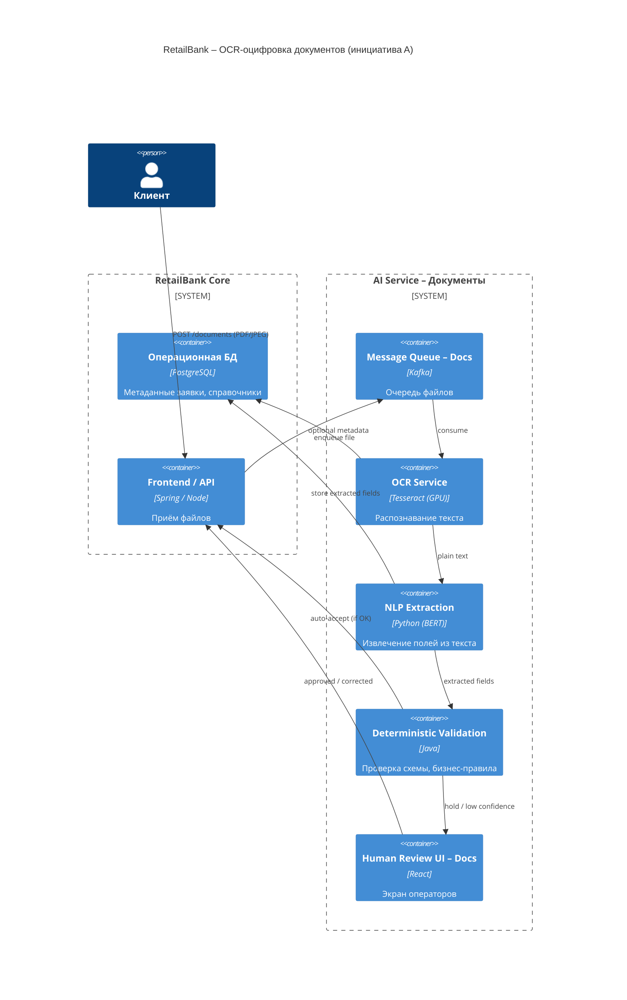
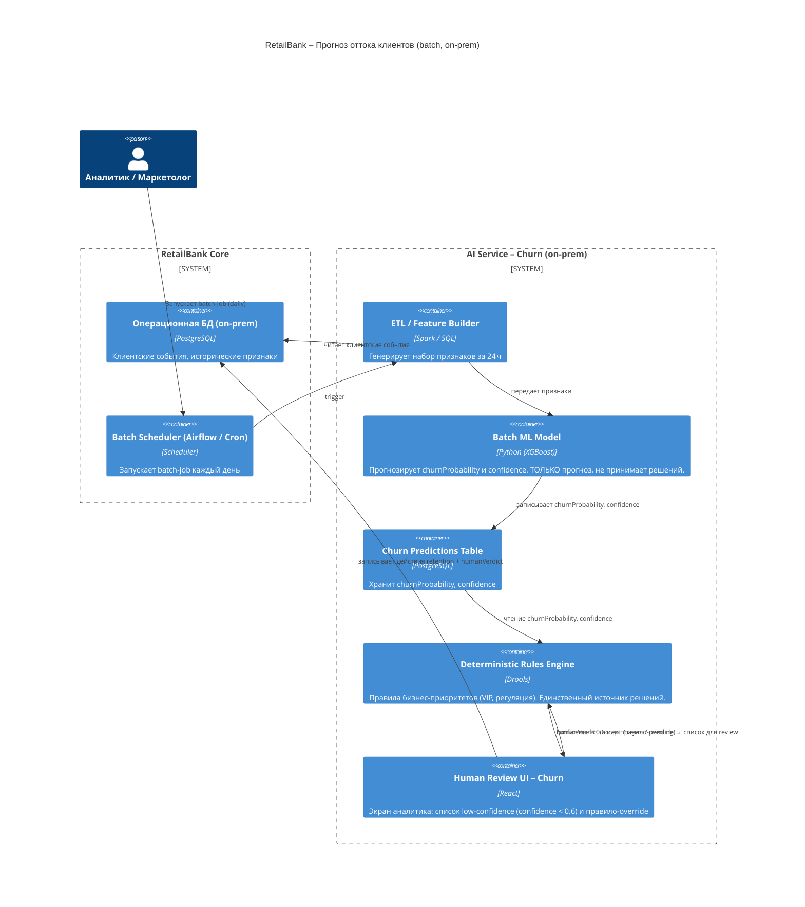

## Задание 3 – Разработка архитектуры AI‑сервиса для RetailBank  

---

### Общее содержание  

| Инициатива | Тип решения | Краткое описание | Статус |
|------------|------------|------------------|--------|
| **F** – Выявление подозрительных операций (транзит, обналичивание, дробление) | Табличный скоринг + правила AML | **Конвейер «признаки → модель → калибровка/порог → детерминированные правила → human‑in‑the‑loop»** (модель выдаёт лишь приоритет, окончательное решение принимает Rules Engine). | Готово (C4‑диаграммы, таблицы, контракт, fallback, мониторинг, угрозы) |
| **A** – OCR‑оцифровка документов к кредитной заявке | OCR + NLP‑extraction + валидация | **Документ → OCR → NLP‑extraction → проверка схемы → human‑review (при низкой уверенности/ошибке)** | Готово (Container‑диаграмма, контракт, fallback, мониторинг) |
| **B** – Прогноз оттока клиентов | Пакетный табличный скоринг + детерминированные правила | **Ежедневный batch‑job → вычисление признаков → модель → таблица прогнозов → Rules Engine → human‑review (при low‑confidence)** | **Обновлено** (batch‑архитектура, on‑prem хранение, согласовано с ADR) |

---

### Контейнерные и компонентные C4‑диаграммы  

#### Флагман — Выявление подозрительных операций (табличный скоринг)  


```mermaid
C4Context
title RetailBank – Флагман: Выявление подозрительных операций (AML)

Person(customer, "Клиент")
System_Boundary(rb, "RetailBank Core") {
    Container(Db, "Операционная БД", "PostgreSQL", "Транзакции, справочники, KYC‑данные")
    Container(KYC, "Внешняя KYC‑платформа", "REST (TLS)", "Риски клиента, статусы")
    Container(API, "Frontend / API", "Spring Boot / Node", "Внутренний API мониторинга")
}
System_Boundary(ai, "AI Service") {
    Container(Queue, "Message Queue", "Kafka", "Буфер запросов")
    Container(FeatureSrv, "Feature Extraction Service", "Java/Scala", "Формирование детерминированных признаков")
    Container(ScoreModel, "ML Scoring Model", "Python (LightGBM)", "Расчёт riskScore (0‑1) и priorityScore (0‑100). ТОЛЬКО приоритет, не принимает решений.")
    Container(Rules, "Deterministic Rules Engine", "Drools", "Бизнес‑правила AML. Единственный источник автоматических accept/reject. При priorityScore > 80 → только hold.")
    Container(HumanUI, "Human Review UI", "React", "Экран аналитика")
}
Rel(customer, API, "Отправка операции")
Rel(API, Queue, "POST /risk‑check")
Rel(Queue, FeatureSrv, "Consume")
Rel(FeatureSrv, Db, "Read ops + справочники")
Rel(FeatureSrv, KYC, "Pull risk signals")
Rel(FeatureSrv, ScoreModel, "JSON‑features")
Rel(ScoreModel, Rules, "riskScore, priorityScore (только приоритет)")
Rel(Rules, API, "finalDecision (accept / reject / hold), decisionSource")
Rel(Rules, HumanUI, "priorityScore > 80, gap [70‑80], low confidence, OOD, missing features → запрос проверки")
Rel(HumanUI, Rules, "humanVerdict (accept / reject / pending)")
Rel(Rules, Db, "store decision history")
```


```mermaid
C4Container
title RetailBank – Компоненты AI‑сервиса (Флагман)

Container_Boundary(ai, "AI Service") {
    Component(API, "REST API `/risk‑check`", "Spring/Node", "Приём запросов, валидация JSON")
    Component(Queue, "Message Queue", "Kafka", "Буфер запросов")
    Component(FeatureExtractor, "Feature Extraction", "Java/Scala", "Сбор и агрегирование признаков")
    Component(ScoreModel, "ML Scoring Model", "Python (LightGBM)", "Выдаёт riskScore (0‑1) и priorityScore (0‑100). ТОЛЬКО приоритет, не принимает решений reject/accept.")
    Component(RulesEngine, "Rules Engine", "Drools", "Бизнес‑правила AML (полностью детерминированы). Единственный источник автоматических accept/reject. При priorityScore > 80 → только hold.")
    Component(HumanRouter, "Human Review Trigger", "Java", "Определяет необходимость human‑in‑the‑loop: priorityScore > 80, gap [70‑80], low confidence, OOD, missing features")
    Component(HumanUI, "Human Review UI", "React", "Экран аналитика")
    Component(DecisionLogger, "Decision Logger", "PostgreSQL", "Единый журнал всех решений: accept / reject / hold / pending")
    Component(Monitoring, "Monitoring", "Prometheus/Loki", "Метрики, алерты, трассировка")
}
Rel(API, Queue, "enqueue request")
Rel(Queue, FeatureExtractor, "consume")
Rel(FeatureExtractor, ScoreModel, "features JSON")
Rel(ScoreModel, RulesEngine, "riskScore, priorityScore, confidence")
Rel(RulesEngine, HumanRouter, "hold? / low‑confidence / priority")
Rel(HumanRouter, HumanUI, "display for review (humanReviewReason)")
Rel(HumanUI, RulesEngine, "humanVerdict (accept / reject / pending), analystId, comment")
Rel(RulesEngine, DecisionLogger, "write decision + decisionSource")
Rel(RulesEngine, API, "finalDecision (accept / reject / hold), decisionSource")
Rel(Monitoring, FeatureExtractor, "metrics")
Rel(Monitoring, ScoreModel, "metrics")
Rel(Monitoring, RulesEngine, "metrics")
Rel(Monitoring, HumanUI, "metrics")

```

#### Инициатива A – OCR‑оцифровка документов к кредитной заявке  


```mermaid
C4Context
title RetailBank – OCR‑оцифровка документов (инициатива A)

Person(customer, "Клиент")
System_Boundary(rb, "RetailBank Core") {
    Container(Db, "Операционная БД", "PostgreSQL", "Метаданные заявки, справочники")
    Container(API, "Frontend / API", "Spring / Node", "Приём файлов")
}
System_Boundary(aiDocs, "AI Service – Документы") {
    Container(DocQueue, "Message Queue – Docs", "Kafka", "Очередь файлов")
    Container(OCRSrv, "OCR Service", "Tesseract (GPU)", "Распознавание текста")
    Container(NLPExtract, "NLP Extraction", "Python (BERT)", "Извлечение полей из текста")
    Container(Validator, "Deterministic Validation", "Java", "Проверка схемы, бизнес‑правила")
    Container(HumanDocUI, "Human Review UI – Docs", "React", "Экран операторов")
}
Rel(customer, API, "POST /documents (PDF/JPEG)")
Rel(API, DocQueue, "enqueue file")
Rel(DocQueue, OCRSrv, "consume")
Rel(OCRSrv, NLPExtract, "plain text")
Rel(NLPExtract, Validator, "extracted fields")
Rel(Validator, API, "auto‑accept (if OK)")
Rel(Validator, HumanDocUI, "hold / low confidence")
Rel(HumanDocUI, API, "approved / corrected")
Rel(OCRSrv, Db, "optional metadata")
Rel(NLPExtract, Db, "store extracted fields")
```

#### Инициатива B – Прогноз оттока клиентов (butch, on-prem)


```mermaid
C4Context
title RetailBank – Прогноз оттока клиентов (batch, on‑prem)

Person(analyst, "Аналитик / Маркетолог")
System_Boundary(rb, "RetailBank Core") {
    Container(Db, "Операционная БД (on‑prem)", "PostgreSQL", "Клиентские события, исторические признаки")
    Container(Scheduler, "Batch Scheduler (Airflow / Cron)", "Scheduler", "Запускает batch‑job каждый день")
}
System_Boundary(aiChurn, "AI Service – Churn (on‑prem)") {
    Container(ETL, "ETL / Feature Builder", "Spark / SQL", "Генерирует набор признаков за 24 ч")
    Container(ChurnModel, "Batch ML Model", "Python (XGBoost)", "Прогнозирует churnProbability и confidence. ТОЛЬКО прогноз, не принимает решений.")
    Container(PredTable, "Churn Predictions Table", "PostgreSQL", "Хранит churnProbability, confidence")
    Container(Rules, "Deterministic Rules Engine", "Drools", "Правила бизнес‑приоритетов (VIP, регуляция). Единственный источник решений.")
    Container(HumanUI, "Human Review UI – Churn", "React", "Экран аналитика: список low‑confidence (confidence < 0.6) и правило‑override")
}
Rel(analyst, Scheduler, "Запускает batch‑job (daily)")
Rel(Scheduler, ETL, "trigger")
Rel(ETL, Db, "читает клиентские события")
Rel(ETL, ChurnModel, "передаёт признаки")
Rel(ChurnModel, PredTable, "записывает churnProbability, confidence")
Rel(PredTable, Rules, "чтение churnProbability, confidence")
Rel(Rules, HumanUI, "confidence < 0.6 или правило‑override → список для review")
Rel(HumanUI, Rules, "humanVerdict (accept / reject / pending)")
Rel(HumanUI, Db, "записывает действия retention + humanVerdict")
```
---

## Процесс ручной проверки (Human-in-the-Loop)

### Когда операция попадает на ручную проверку

| Триггер | Условие | Приоритет в очереди |
|---------|---------|---------------------|
| **Высокий приоритет модели** | `priorityScore > 80` | Высокий |
| **Зона неопределённости** | `priorityScore ∈ [70‑80]` | Средний |
| **Низкая уверенность модели** | `confidence < 0.7` | Средний |
| **OOD‑детекция** | Признаки вне области обучения | Высокий |
| **Отсутствие признаков** | `featuresValid = false` | Высокий |

### Порядок работы аналитика

1. **Получение операции** — аналитик видит в Human Review UI:
   - Детали операции (сумма, контрагент, назначение платежа).
   - `riskScore`, `priorityScore`, `confidence` от модели.
   - Сработавшие детерминированные правила.
   - Историю клиента (предыдущие решения, KYC‑статус).
   - Причину попадания на ручную проверку (`humanReviewReason`).

2. **Анализ** — аналитик изучает операцию в контексте:
   - Профиля клиента (ОКВЭД, обороты, страна).
   - Цепочки связанных операций.
   - Сигналов от внешней KYC‑платформы.

3. **Вердикт** — аналитик выносит одно из решений:
   - `accept` — операция легитимна.
   - `reject` — операция блокируется, формируется сообщение в Росфинмониторинг.
   - `pending` — требуется дополнительная информация (запрос клиенту, углублённая проверка).

4. **Фиксация** — вердикт записывается в аудит‑лог:
   ```json
   {
     "operationId": "string",
     "analystId": "string",
     "verdict": "enum[accept, reject, pending]",
     "comment": "string (обязательно при reject/pending)",
     "timestamp": "ISO‑8601",
     "reviewDurationMs": "integer"
   }

### SLA ручной проверки

| Приоритет | Максимальное время реакции | Максимальное время вердикта |
|-----------|---------------------------|----------------------------|
| Высокий (`priorityScore > 80`, OOD, missing features) | 5 мин | 15 мин |
| Средний (`priorityScore ∈ [70‑80]`, `confidence < 0.7`) | 15 мин | 60 мин |

### Эскалация

Если аналитик не может вынести вердикт в течение SLA:
1. Операция автоматически помечается `pending`.
2. Уведомление направляется старшему аналитику / Compliance Officer.
3. При отсутствии реакции в течение 4 часов — операция передаётся в Compliance Department.

### Таблица ответственности компонентов (RACI)

| Компонент | R (Ответственный) | C (Консультируемый) | I (Информируемый) | A (Выполняющий) |
|-----------|-------------------|---------------------|-------------------|-----------------|
| **API (Frontend / API)** | Team API (Backend) | Product Owner, AML Team, Compliance | Аналитики, SRE | Team API |
| **Message Queue (Kafka)** | Platform Ops | Team API, Data Engineering | Все команды | Platform Ops |
| **Feature Extraction Service** | Data Engineering | AML Team, Compliance | Product Owner | Data Engineering |
| **ML Scoring Model** | Data Science – AML | Feature Service, Compliance | Product Owner | Data Science |
| **Calibration & Threshold Service** | Data Science – AML | Business Analyst | Product Owner | Data Science |
| **Deterministic Rules Engine** | Business Rules Team | Compliance, Risk | Product Owner | Business Rules Team |
| **Human Review UI** | UX / Frontend Team | Business Analyst, Compliance | Product Owner | UX / Frontend Team |
| **OCR Service** | Document Engineering | Compliance, Legal | Product Owner | Document Engineering |
| **NLP Extraction** | NLP Team (Data Science) | Document Engineering | Product Owner | NLP Team |
| **Doc Validation Rules** | Business Rules Team | Compliance | Product Owner | Business Rules Team |
| **Churn Feature Service** | Data Engineering – Churn | Marketing, Risk | Product Owner | Data Engineering |
| **Churn Model** | Data Science – Churn | Feature Service | Product Owner | Data Science |
| **Churn Rules Engine** | Business Rules Team – Churn | Marketing, Compliance | Product Owner | Business Rules Team |
| **Churn Human Review UI** | UX / Frontend Team – Churn | Business Analyst, Marketing | Product Owner | UX / Frontend Team |
| **Monitoring (Prometheus + Loki)** | SRE / Platform Ops | Все команды | Руководство | SRE |

---

### Выходные контракты (Response Schemas)

#### Флагман – Выявление подозрительных операций  

```json
{
  "requestId": "string (uuid)",
  "operationId": "string",
  "decision": "enum[queued, accept, reject, hold]",
  "decisionSource": "enum[rules_engine, human_review]",
  "riskScore": "number (0‑1)",
  "priorityScore": "number (0‑100)",
  "modelVersion": "string",
  "featuresUsed": ["list of feature names"],
  "ruleTriggers": ["list of rule identifiers (optional)"],
  "humanReviewRequired": "boolean",
  "humanReviewReason": "enum[low_confidence, high_priority, ood_detection, missing_features, gap_zone] | null",
  "humanVerdict": "enum[accept, reject, pending] | null",
  "timestamp": "ISO‑8601",
  "source": {
    "operationRecordId": "string",
    "kcySignalIds": ["array of ids"]
  },
  "validation": {
    "featuresValid": "boolean",
    "missingFeatures": ["array (optional)"]
  },
  "audit": {
    "processingTimeMs": "integer",
    "queueDelayMs": "integer"
  }
}
```

#### OCR‑оцифровка документов  

```json
{
  "requestId": "string (uuid)",
  "documentId": "string",
  "extractedFields": {
    "fieldName": "value",
    "...": "..."
  },
  "confidence": "number (0‑1)",
  "modelVersion": "string",
  "validation": {
    "schemaValid": "boolean",
    "missingFields": ["array (optional)"]
  },
  "humanReviewRequired": "boolean",
  "humanVerdict": "enum[accept, reject, needsCorrection] | null",
  "timestamp": "ISO‑8601"
}
```

*Если `confidence < 0.8` **или** обнаружены конфликты полей → `humanReviewRequired: true`.*

#### Прогноз оттока (batch-контракт)  

```json
{
  "batchId": "string (uuid)",
  "runTimestamp": "ISO‑8601",
  "predictionCount": "integer",
  "predictions": [
    {
      "customerId": "string",
      "churnProbability": "number (0‑1)",
      "confidence": "number (0‑1)",
      "ruleApplied": "boolean",
      "humanReviewRequired": "boolean"
    }
    // … может быть до сотен тысяч записей
  ],
  "status": "enum[success, partial_failure, failure]",
  "errorDetails": "string (optional)"
}
```
*Если humanReviewRequired = true – запись попадёт в Human Review UI для дальнейшего подтверждения/корректировки.*

---

### Уровень автоматизации  

| Сценарий | Что делает модель | Что делают правила | Где обязателен человек |
|----------|------------------|--------------------|------------------------|
| **Флагман – обычный поток** | Выдаёт `riskScore` (0‑1) и `priorityScore` (0‑100) — **только приоритет**, не принимает решений | Детерминированные AML‑правила принимают окончательное решение `accept` / `reject` / `hold` | Если `priorityScore ∈ [70‑80]` **или** `confidence < 0.7` **или** OOD‑детекция → *Human Review* |
| **Флагман – высокий приоритет** | `priorityScore > 80` — модель сигнализирует о высоком риске | Правила помечают операцию `hold`, запись в журнал, уведомление | **Обязателен** — операция направляется в Human Review UI независимо от правил |
| **OCR** | Распознаёт текст, извлекает поля | Проверка формата, контрольные суммы, бизнес‑правила | `confidence < 0.8` **или** конфликт → *Human Review* |
| **Churn** | Прогнозирует вероятность оттока | Если вероятность > 0.8 → «приоритет удержания», иначе «стандарт»; дополнительные правила (VIP, регуляция) | `confidence < 0.6` **или** правило‑override → *Human Review* |

---

### Fallback‑стратегии  

| № | Признак отклонения | Действие | Куда направляется |
|---|--------------------|----------|-------------------|
| 1 | Отсутствие/устаревание признаков (FeatureValidator) | `humanReviewRequired = true` → **Human Review UI** | Human Review UI |
| 2 | OOD‑detекция признаков | `humanReviewRequired = true` (при сохранении `priorityScore`) | Human Review UI |
| 3 | Новый клиент без истории | `priorityScore = 80`, `humanReviewReason = "missing_features"` → **Human Review** | Human Review UI |
| 4 | Зона «зазор» (`priorityScore ∈ [70‑80]`) | `humanReviewReason = "gap_zone"` → **Human Review** (правила не принимают решение, только аналитик) | Human Review UI |
| **14 (новый)** | **Высокий приоритет (`priorityScore > 80`)** | `humanReviewReason = "high_priority"` → **обязательный Human Review** (правила помечают `hold`, авто‑reject запрещён) | Human Review UI |
| 5 | Конфликт модели и правила (Churn) | Приоритет правила → **Rule‑Only** (автоматическое `accept`/`reject` без модели) | Rules Engine |
| 6 | Недоступность модели/сервиса (любая инициатива) | Переключить в **Rule‑Only** режим | Rules Engine |
| 7 | Неверный JSON‑ответ модели | `400 Bad Request`, логировать | API‑клиент |
| 8 | OCR‑схема не прошла валидацию | **Human Review** (показ оригинала + поля) | Doc Human Review UI |
| 9 | Противоречивые документы | **Human Review** с пометкой «конфликт» | Doc Human Review UI |
| 10 | Запрос вне области применимости (Churn) | `403 Forbidden` + ссылка на справку | API‑клиент |
| 11 | Отказ внешнего сервиса (KYC, OCR SaaS) | **offline‑mode** – только локальные правила | Rules Engine |
| 12 | Превышение лимитов очереди | Дрейн‑режим → новые запросы сразу в **Human Review** | Human Review UI |
| 13 | XSS/малициозный файл (OCR) | Блокировать, вернуть `415 Unsupported Media Type` | API‑клиент |

---

### План мониторинга  

| Уровень | Метрика | Порог тревоги | Действие |
|--------|---------|---------------|----------|
| API | `request_rate`, `error_rate (4xx/5xx)` | > 200 req/s, > 2 % 5xx | Авто‑скейлинг, алерт SRE |
| Очереди | `queue_length`, `lag_ms` | > 10 000 сообщений, `lag_ms > 5 000` | Увеличить concurrency, алерт |
| Feature Extraction | `extraction_time_ms`, `missing_features_rate` | > 200 ms, > 5 % missing | Перезапуск, проверка источников |
| FeatureValidator / OOD | `featureValidatorErrors`, `oodDetectionRate` | > 2 % всего | Алерт, эскалация к Data‑Science |
| **Batch Scheduler (Churn)** | `job_success_rate` (за последние 7 дн) | < 95 % | Алерт, автоматический retry |
| **ETL / Feature Builder** | `rows_processed / rows_expected` | < 98 % | Алерт, проверка источников |
| **ML Model (Churn)** | `drift_score (PSI)` | > 0.1 | Перевести модель в **read‑only**, запустить пере‑обучение |
| **Predictions (Churn)** | `low_confidence_rate` (`confidence < 0.6`) | > 20 % | Информировать бизнес о качестве модели |
| Rules Engine | `rule_trigger_rate`, `rule_reject_rate` | > 30 % hold‑rate, > 40 % reject‑rate без human‑review | Пересмотр бизнес‑правил |
| Human Review | `avg_review_time`, `queue_backlog_human`, `escalation_rate` | > 15 min, backlog > 500, escalations > 10 % | Добавить операторов, пересмотреть SLA |
| Бизнес‑метрики | `falsePositiveRate`, `falseNegativeRate`, `blocked_transactions_per_month` | FP > 3 %, FN > 1 % | Пересчитать ROI, возможный откат модели |
| Безопасность | `sensitive_data_leak_events`, `unauthorized_access_attempts` | > 0 | Инцидент‑процесс, немедленная блокировка |

*Автоматический откат:* при превышении `drift_score` система переводит модель в **read‑only**, генерирует задачу пере‑обучения и переключает поток на **Rule‑Only** (см. fallback № 6).

---

### Границы доверия + таблица угроз  

| № | Граница (на схеме) | Тип данных | Угроза | Мера снижения |
|---|----------------------|------------|--------|----------------|
| **1** | Frontend → API (внешний запрос) | Неаутентифицированный JSON | Инъекция, DoS, подделка | JWT‑подпись, rate‑limiting, JSON‑schema validation |
| **2** | FeatureSrv ← KYC (REST) | Риск‑сигналы KYC | Подмена / перехват | TLS 1.3, HMAC подпись запросов, контрольные суммы |
| **3** | Model ← FeatureSrv (признаки) | Признаки операции | Adversarial‑атака, подмена | HMAC подпись payload, whitelist признаков, контроль целостности |
| **4** | RulesEngine ← Model (riskScore + priorityScore) | Вывод модели | Rule‑poisoning, конфликт правил | Тест‑suite правил, ограничение прав изменения |
| **5** | Client → API (документ) | PDF/JPEG (неструктурированный) | Вредоносный файл, steganography, XSS | Проверка MIME‑type, антивирус‑скан, лимит ≤ 10 MB |
| **6** | OCRSrv ← документ | Необработанное изображение | Оффлайн‑атака, скрытый код | Sandbox‑окружение, ограничение прав процесса OCR |
| **7** | Classifier ← текст (Churn) | Свободный текст | Prompt‑injection, языковые атаки | Очистка/экранирование, whitelist‑словарей, ограничение длины |
| **8** | External AML/KYC API → FeatureSrv | Внешний API‑ответ | Перехват / модификация | TLS, подпись API‑ключей, проверка хэша ответа |

---

### Краткие выводы и рекомендации бизнесу  

| Пункт | Вывод |
|-------|-------|
| **Модель** | **Только приоритет** (`riskScore` + `priorityScore` для Флагмана; `churnProbability` + `confidence` для Churn). **Никогда не принимает окончательное `reject/accept`.** Даже при `priorityScore > 80` решение остаётся за правилами (hold) и человеком (окончательный вердикт). |
| **Бизнес‑правила** | **Единственные** источники автоматического решения (`accept`/`reject`). При `priorityScore > 80` правила **не могут** автоматически отклонить операцию — только `hold` и передача в Human Review. |
| **Human‑review** | Срабатывает при **низкой уверенности**, **OOD‑детекции**, **высоком приоритете** (`priorityScore > 80`), **зоне зазора** (`priorityScore ∈ [70‑80]`), **отсутствии признаков**. Является **обязательным** для высокоприоритетных операций. |
| **Размещение** | Все три инициативы **on‑prem** (или гибрид с GPU‑контуром в РФ). Для Churn — полностью on‑prem, без облачных сервисов. |
| **Batch‑прогноз** | Прогноз оттока теперь **ежедневный batch‑job**; результаты сохраняются в локальной таблице и обрабатываются Rules Engine → Human Review UI. |
| **Мониторинг** | Добавлен контроль за batch‑job (успешность, drift, low‑confidence). |
| **Тестирование** | Пилотный запуск в *shadow‑mode* (модель генерирует приоритет/прогноз, но решения принимаются только правилами и human‑review). После подтверждения KPI (корректность приоритета, отсутствие роста FN) – полное включение в прод. |
